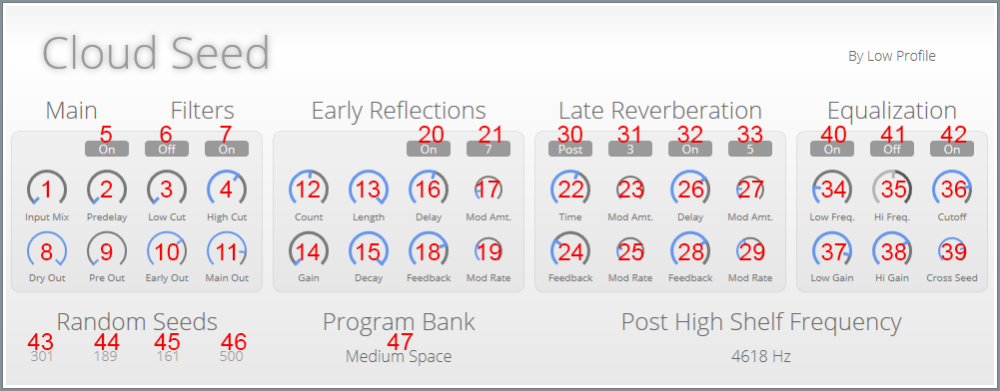
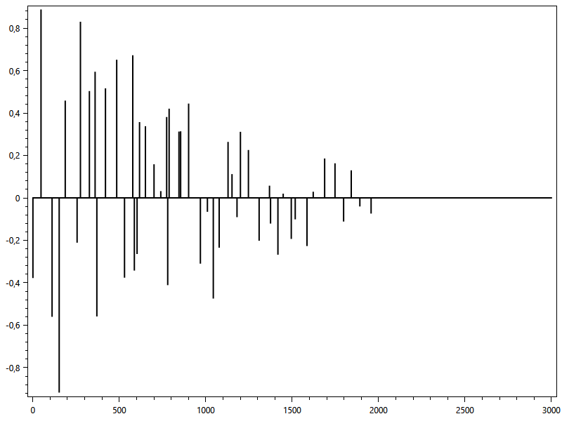
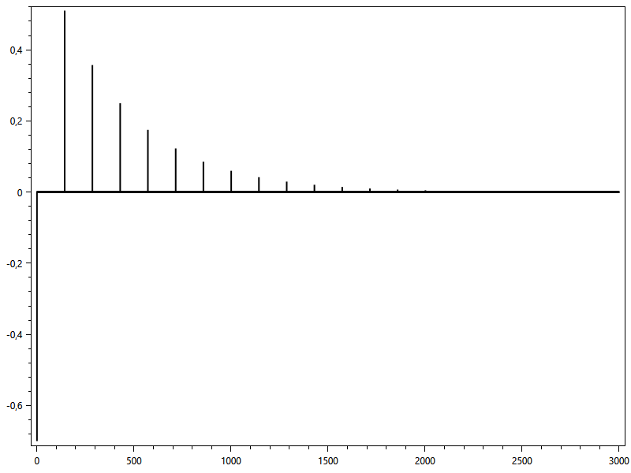
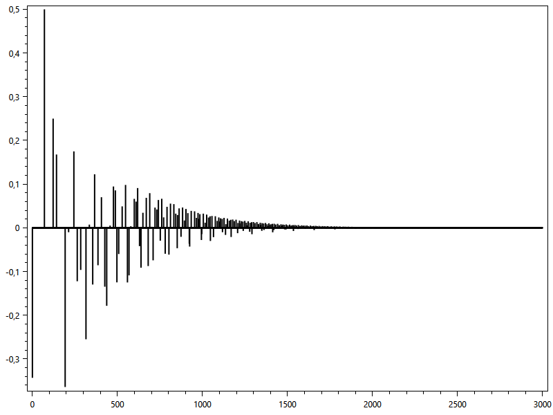
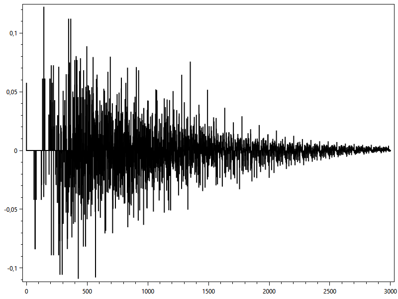
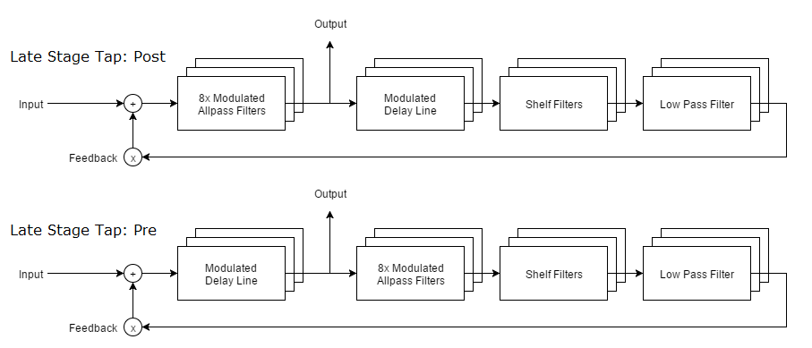

# Introduction

Cloud Seed is a VST plugin for Windows. It supports both 32 bit and 64 bit hosts.

**Software Requirements**

* Windows 7+
* VST-compatible DAW (32 or 64 bit)
* .NET Framework 4.0 or higher

# Block Diagram and controls

## Input and Predelay

Input Mix (1) - Controls the amount of mixing between the two input channels. It lets you send a part of the Left input to the Right channel and vice versa. When set to zero, no mixing occurs. When set to 100%, an even mix of the left and right inputs is fed into both channels.

Predelay (2) - Adds a delay to the signal before it enters the reverberation process. Can add a felling of size to the sound.

## Main

Interpolation (5) - A special toggle switch that lets you disable the linear interpolation in the late diffuser when using modulation.
  
* When on: smoothly interpolates between two samples. This gives a nice sound, but the simple linear interpolation cuts away some of the high frequencies in the signal, so it also acts as a subtle low-pass filter.
* When off: Not interpolation takes place and the playback he "skips" between samples when it is moduled. This gives a very crisp sound, but results in a white noise component, which can be very pleasant when using very long decay times, giving the signal a more "airy" feeling.

## Filters

Low Cut (3) - First order high pass filter to cut away low frequencies before the signal enters the reverberation unit.

High Cut (4) - First order high pass filter to cut away high frequencies before the signal enters the reverberation unit.

High Pass Enabled (6) - Enables or disables the Low Cut (High Pass) filter.

Low Pass Enabled (7) - Enables or disables the High Cut (Low Pass) filter.

## Mixer

Dry Out (8) - Controls the amount of dry signal mixed into the output signal.

Dry Out (9) - Controls the amount of signal from the Pre-delay filter mixed into the output signal.

Early Out (10) - Controls the amount of signal from the Early Reflections block mixed into the output signal.

Main Out (11) - Controls the amount of signal from the Late Reverberation block mixed into the output signal.

## Early Reflections

The early reflections block consists of two components: a multitap delay, and a series of Schroeder allpass filters.

### Multitap Delay

This block contains a 500ms delay line with up to 50 taps. The taps and the gain is set randomly, controlled by the Tap Seed (43) control. 

An example impulse response:

Count (12) - Controls the number of taps, from 1-50.

Length (13) - Controls the impulse response length, in mililseconds.

Gain (14) - Controls the mix of dry signal to delay tap output. A zero values give no tap signal, and at maximum the output comes only from the taps.

Decay (15) - Controls the decay of the taps. The later taps have less gain, resulting in an exponentially decaying response at the maximum setting, or an almost flat response at zero.

### Series Allpass Filters

For a quick overview of Schoeder Allpass sections, have a look at [Stanford's CCRMA section on the topic](https://ccrma.stanford.edu/~jos/pasp/Schroeder_Allpass_Sections.html).

Impulse response of a single allpass filter:

Impulse response of 3 allpass filters in series:

Impulse response of 8 single filtes in series:

The allpass section is used to "thicken up" the reflections of the reverb. However, they can and will color the sound, and they also make the the response non exponentially decaying, when you put multiple filters in series.

All the controls of each schroeder unit are scaled with random values, controlled by the Diffusion Seed (45), so every unit has slightly different parameters. Different seeds will give different results, some will sound very metallic and harsh, while others will sound smooth and pleasant. Experiment to find settings that fit your desired sound.

Delay (16) - Controls the delay of the allpass units.

Mod Amt (17) - Control the amount of modulation applied to the delay. When this parameters is set to zero, the output of from the diffusion block becomes brighter, as it will not be applying linear interpolation, since the amount of delay will always be an integer number of samples.

Feedback (18) - Controls the amount of feedback in each unit (usually referred to as the "gain" or "g" parameter of the Schroeder unit).

Mod Rate (19) - Controls the rate of modulation applied to the allpass delay.

Diffusion Enabled (20) - Enable or disable the diffusion block.

Diffusion Stage (21) - The number of series allpass units (1-8).

## Late Reverberation

The late Reverberation block consists of up to 12 parallel delay lines. Each delay line has a feedback control, the feedback signal is processed through a high- and low- shelf filter, as well as a first order low pass filter. Finally, a Schroeder allpass filter block (identical to the one used in the Early Reflections block) is placed in the feedback chain.

You can also change the order in which the delay and the allpass filter are processed, by using the Late Stage Tap (30) control.

Time (22) - The delay time of the main delay.

Mod Amt. (23) - The amount of modulation applied to the main delay.

Feedback (24) - The amound of signal fed back through the delay line.

Mod Rate (25) - The rate of modulation applied to the main delay.

Delay (26) - Controls the delay of the allpass units in the feedback signal chain.

Mod Amt (27) - Control the amount of modulation applied to the delay of the allpass units. When this parameters is set to zero, the output of from the diffusion block becomes brighter, as it will not be applying linear interpolation, since the amount of delay will always be an integer number of samples.

Feedback (28) - Controls the amount of feedback in each unit (usually referred to as the "gain" or "g" parameter of the Schroeder unit).

Mod Rate (29) - Controls the rate of modulation applied to the allpass delay.

Late Stage Tap (30) - Controls the signal path used (see diagram). When set to Post, the sound is processed through the allpass unit first, giving a ticker, lusher sound, but adding more delay to the overall output (as the allpass filters themselves have some delay).

Line Count (31) - The numbers of parallel delay lines used. Use a low number for a clearer sound, a higher number for a thicker, bigger sound.

Late Diffusion Enabled (32) - Allows you to bypass the allpass diffuser in the feedback chain completely.

Late Diffusion Stage (33) - The numbers of series allpass stages in the unit.

Low Freq (34) - The cutoff frequency for the feedback low-shelf filter. 

Hi Freq (35) - The cutoff frequency for the feedback high-shelf filter.

Cutoff (36) - The cutoff frequency for the feedback low-pass filter.

Low Gain (37) - The amount of gain reduction in the low shelf filter.

Hi Gain (38) - The amount of gain reduction in the high shelf filter.

Low Shelf Enabled (40) - Enables or Disables the Low Shelf filter.

High Shelf Enabled (41) - Enables or Disables the High Shelf filter.

Cutoff Enabled (42) - Enables or Disabled the Low pass filter.

## Seed Controls

Cross Seed (39) - This controls how the random values for the left and right channels are mixed.

When you select a seed, two series of random numbers are computed from that seed, one for the seed value, and another for its bit-wise inverse. 

When the Cross-Seed parameter is set to zero, the left and right channel will use exactly the same random numbers to adjust their controls. But when turning the parameter up, the right channel wil use a mixture of the two random series. Turning it all the way up means the two channels use completely different sets of random numbers. This makes the output sound "wider", as each channel will process the sound differently.

Tap Seed (43) - Controls the random values used to generate the multi-tap delay impulses, their delays and gains.

Diffusion Seed (44) - Control the random values used by the Early Reflections allpass filters. Affects the delays, modulation amount and modulation rate.

Delay Seed (45) - Controls the random values used by the delay line. Controls delay time, modulation amount and modulation rate.

Post Diffusion Seed (46) - Control the random values used by the Late Reverberation allpass feedback filters. Affects the delays, modulation amount and modulation rate.

## Preset Selection

You can load, save and delete presets by click the current preset's name (47). The presets are stored as json files in folder next to the plugin dll.

## About random seeds

Cloud Seed relies heavily on being able to experiment with the random seeds, and to choose values that sound good. In order to generate consistent series of random numbers, Cloud Seed uses the SHA256 algorithm to generate random sequences. This ensures that presets will sound the same on every machine and even when the code is compiled using different compilers (otherwise, different implementations of random number generators might significantly affect the sound).  