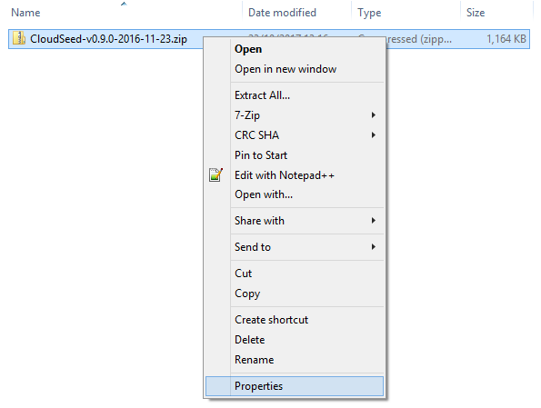
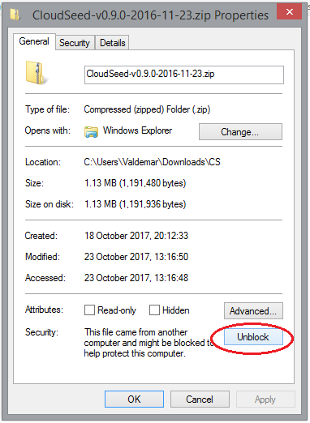

# Installation Instructions

CloudSeed does not come with an installer and can usually be extracted directly from a zip archive into your VSTplugins directory. However, some users have reported some issues because of changes in Windows 8.1 and Windows 10 which may require some additional steps to get it working.

1. Open the CloudSeed Release page in your browser:
  * **[https://github.com/ValdemarOrn/CloudSeed/releases](https://github.com/ValdemarOrn/CloudSeed/releases)**
  * Download the latest zip file (i.e. **CloudSeed-v0.9.0-2016-11-23.zip**)
2. Once downloaded, find the file on your hard drive.
  * Right click and select Properties: 
  * 
  * If visible, click the “Unblock” button and then OK. This is to allow Windows to execute the code inside the archive once extracted. Previous versions of Windows did not have this extra security step, and not all users are affected.
  * 
  * This should be enough to allow Windows 10 to run the plugin, however, in extreme cases, you may need to repeat this procedure on every file after you extract the zip archive.
3. Extract the contents of the zip file into your VstPlugins folder (i.e. **C:\Program Files\Steinberg\VstPlugins**)
  * You should see two directories, one for the 32 bit version (x86) and the 64 bit version (x64). You can keep both, or only the one that matches your DAWs architecture. 
4. Start your VST host software. If you receive any errors while the plugin is loading, you may need to install the relevant “Visual C Runtime” package from Microsoft.
  * The update can be **[downloaded directly from Microsoft](https://www.microsoft.com/en-us/download/details.aspx?id=48145)**. Alternatively, if you have trouble using the website (I did), direct downloads are available:
    * **[32 bit version](http://download.microsoft.com/download/9/3/F/93FCF1E7-E6A4-478B-96E7-D4B285925B00/vc_redist.x86.exe)**
    * **[64 bit version](http://download.microsoft.com/download/9/3/F/93FCF1E7-E6A4-478B-96E7-D4B285925B00/vc_redist.x64.exe)** 
5. User programs are stored in a sub-directory 
  * i.e. C:\Program Files\Steinberg\VstPlugins \CloudSeed\x64\CloudSeed\Programs\User Programs\)
  * If you want to back up your programs, copy these files to a backup location.

#Known issues

1. On some machines the editor can interfere with the real-time audio process. You may notice audio dropouts or glitches when moving knobs and spinners on the UI. However, no audio glitches should occur when the editor is not being actively used, and the plugin should run stable in the background.
