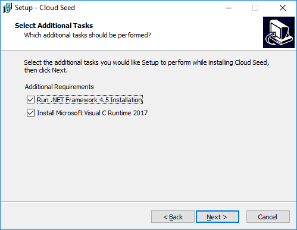

# Installation Instructions

Download the latest version from the **[Releases page](https://github.com/ValdemarOrn/CloudSeed/releases)**.

Cloud Seed can be installed in two different ways:

* By running the automated installer
* By extracting an installer-less zip file containing the plugin files.

## Using the Automated Installer 

As of version 1.0, Cloud Seed is provided with a full installer which includes all required libraries, including the Microsoft Visual C Runtime and .NET Framework 4.5.
I strongly recommend using the installer to ensure proper installation of the plugin. If you are unsure whether you already have the required dependencies installed, you can safely run the additional steps, they will check your system and only install whatever is necessary.

Download the latest installer (for example, "CloudSeed-v1.0-Setup.exe") from the releases page and follow the steps as requested.

## Installer-less Zip file

Manually installing plugins under Windows 10 has become very difficult due to increased security checks in Windows. The following describes the steps required. I recommend this only for advanced users, the automated installer should be preferred.

1. Open the CloudSeed Release page in your browser and Download the latest zip file (i.e. **CloudSeed-v1.0-2018-04-25-NoInstall.zip**)
2. Once downloaded, find the file on your hard drive.
    * Right click and select Properties: 
    * 
    * If visible, click the “Unblock” button and then OK. This is to allow Windows to execute the code inside the archive once extracted. Previous versions of Windows did not have this extra security step, and not all users are affected.
    * 
    * This should be enough to allow Windows 10 to run the plugin, however, in extreme cases, you may need to repeat this procedure on every file after you extract the zip archive.
3. Extract the contents of the zip file into your VstPlugins folder (i.e. **C:\Program Files\Steinberg\VstPlugins**)
4. Start your VST host software. If you receive any errors while the plugin is loading, you may need to install the relevant “Visual C Runtime” package from Microsoft.
    * [Microsoft Web Page (scroll to bottom of page)](https://www.visualstudio.com/downloads/)
    * [x64 Direct Link](https://aka.ms/vs/15/release/VC_redist.x64.exe)
    * [x86 Direct Link](https://aka.ms/vs/15/release/VC_redist.x86.exe)
5. User programs are stored in a sub-directory where you installed the plugin
    * i.e. C:\Program Files\Steinberg\VstPlugins\CloudSeed\CloudSeed\Programs\User Programs\
    * If you want to back up your programs, copy these files to a backup location.

# Known issues

1. On some machines the editor can interfere with the real-time audio process. You may notice audio dropouts or glitches when moving knobs and spinners on the UI. However, no audio glitches should occur when the editor is not being actively used, and the plugin should run stable in the background.
2. If you've previously had CloudSeed installed (prior to v1.0), the 32bit version may interfere with the 64bit version and vise versa. This problem can persist even after one version has been deleted (notably Reaper has issues with this). In order to fully recover I recommend the following steps:
    * Delete/Uninstall CloudSeed from your system.
    * Start your host and re-scan your plugins folder. This should remove any trace of CloudSeed
    * Download the latest version (v1.0 or later) and install it
    * Start your host, it should detect the plugin without problems.
