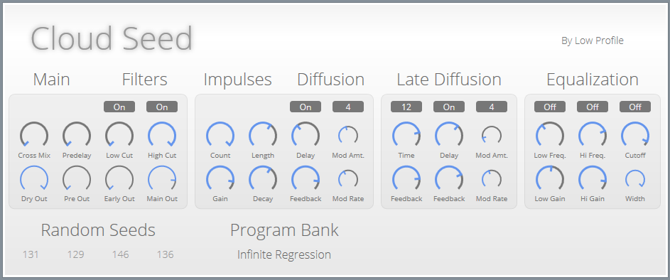

CloudSeed is an algorithmic reverb plugin built in C# and C++ for emulating huge, endless spaces and modulating echoes, in the spirit of classic studio reverb units like the Lexicon 224.

It is still in early development, the active code is currently written in C# but I am doing a re-write of the reverberation kernel in C++ to improve stability and performance.