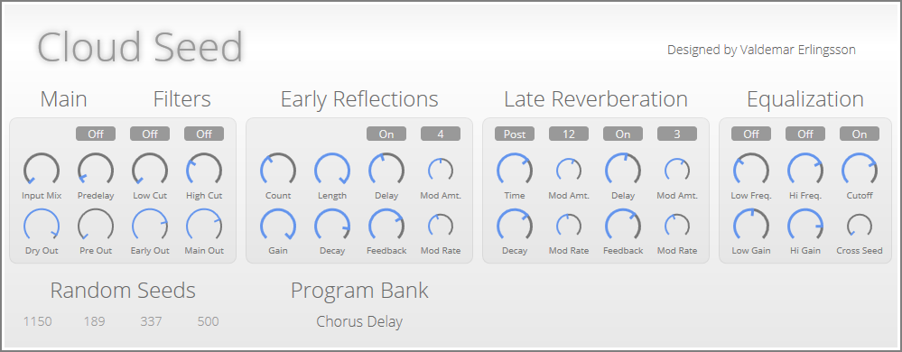
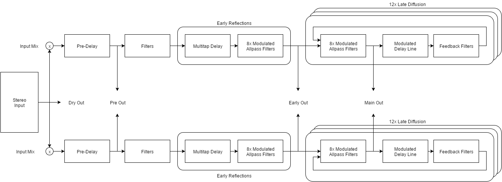

## Cloud Seed VST

Cloud Seed is an algorithmic reverb plugin built in C# and C++ for emulating huge, endless spaces and modulated echoes. The algorithms are based on the same principles as manu classic studio reverb units from the 1980's, but Cloud Seed does not attempt to model any specific device, or even to be a general-purpose reverb plugin at all. It is best employed as a special effect, for creating thick, lush pads out of simple input sounds. 

## Download & Install

1. Download the latest version of Cloud Seed from the [**Releases Page**](https://github.com/ValdemarOrn/CloudSeed/releases).
2. Please read the **[Installation Instructions](https://github.com/ValdemarOrn/CloudSeed/tree/master/Installation%20Instructions)**

**If you get errors about either "vcruntime140.dll" or 
"msvcp140.dll", you need to install the Redistributable Runtime as described in the Installation Instructions.**

## Documentation

See the [**Documentation Page**](https://github.com/ValdemarOrn/CloudSeed/tree/master/Documentation) for an overview of the user interface and an explanation of the reverberation kernel.

## Reverb Kernel Architecture

the code was originally developed in C# and then ported over to C++. The current version contains a full implementation of the reverb kernel in CPU-efficient C++ code. The user interface is built using WPF (Windows Presentation Foundation), and the plugin uses [SharpSoundDevice](https://github.com/ValdemarOrn/SharpSoundDevice) to communicate with a VST host.