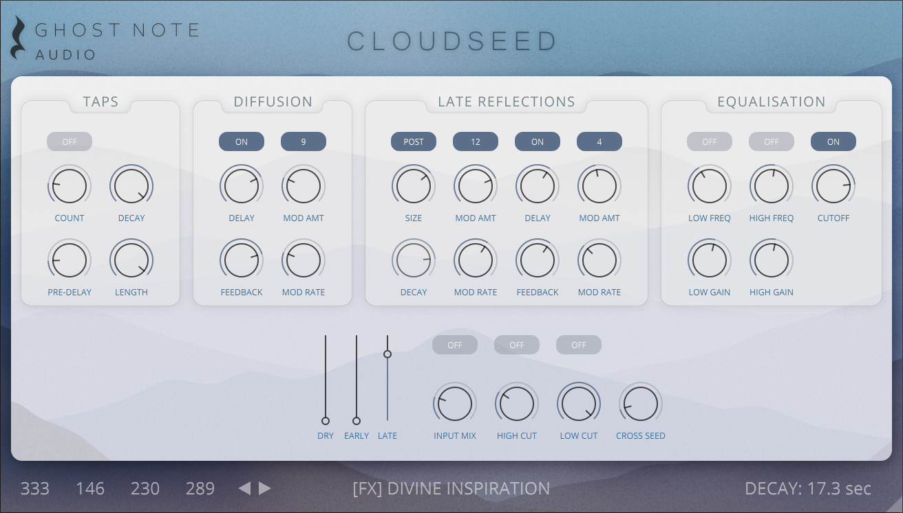

# Cloud Seed has moved to a new home

For the latest version of Cloud Seed, please visit **[Ghost Note Audio](https://ghostnoteaudio.uk/products/cloudseed)**.

This is my new business, where Cloud Seed development will continue and new versions will be published.

Cloud Seed is an algorithmic reverb plugin built in C# and C++ for emulating huge, endless spaces and modulated echoes. The algorithms are based on the same principles as manu classic studio reverb units from the 1980's, but Cloud Seed does not attempt to model any specific device, or even to be a general-purpose reverb plugin at all. It is best employed as a special effect, for creating thick, lush pads out of simple input sounds. 

## Cloud Seed Core - Open Source

If you are interested in using Cloud Seed in your own software, you can download the latest version of the core algorithm from the repository:

https://github.com/GhostNoteAudio/CloudSeedCore

## Legacy Code

If you would like to study the legacy C# code and the original Cloud Seed plugin, the last released version is available on this branch:

https://github.com/ValdemarOrn/CloudSeed/tree/legacy-v1

